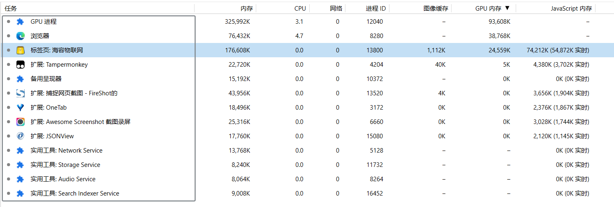
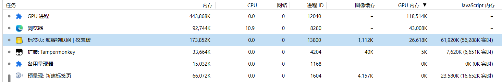

## TB集成Three.JS问题

### 问题描述

页面在2分钟后开始响应卡顿，鼠标拖动转换角度时，延迟较大。

### 猜想一：资源释放问题

1. 通过访问浏览器任务管理器，发现3D模型标签页的资源消耗量较大

   

2. 通过查询资料，typescript垃圾回收是由JS引擎自动处理，同时，发现在其他非3D模型标签页，资源消耗在量级上基本持平。

   

   且使用js代码实现的模型与ofbiz集成模型进行对比，该情况同样存在，故推翻该猜想。

### 猜想二：模型优化问题

1. 改用最新的`.glb`文件，上述情况有所缓解。